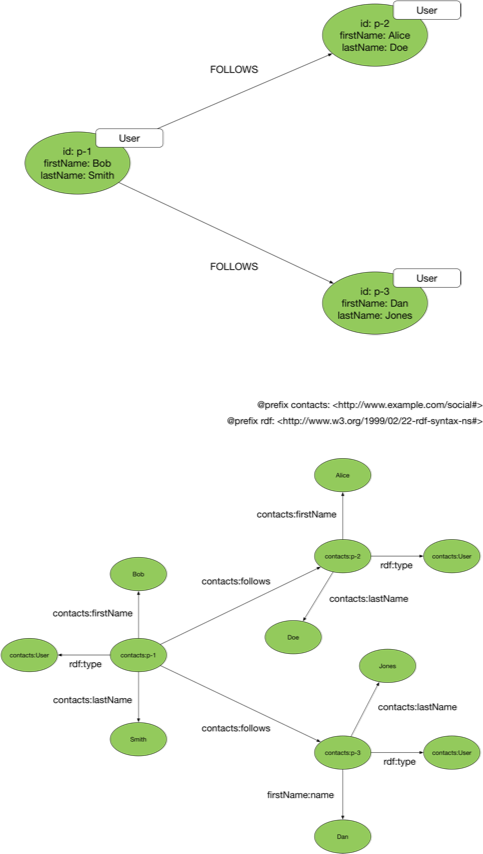
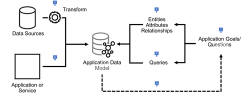
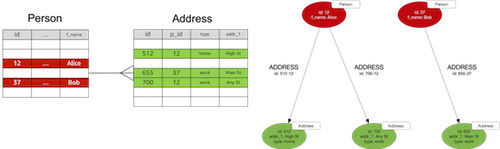
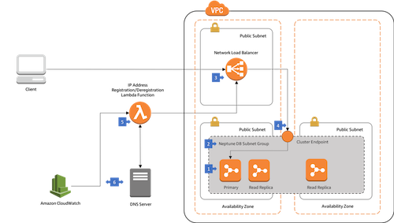
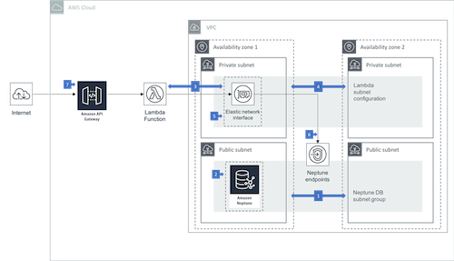
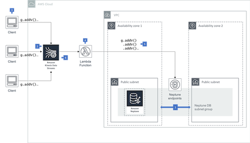

__Graph Database__ workloads are operational and business intelligence database workloads that store and query highly connected data.

Example graph database workloads include:

  * __Knowledge graphs__ In a general sense, a knowledge graph is a network or connected representation of things relevant to a specific domain or organization. Examples include a movie-based knowledge graph containing details of movies, the actors who have appeared in these movies, and the production staff members who have worked on them; an art graph, containing details of museums, the works of art displayed in each museum, and the artists who have created these works of art; and an organizational knowledge graph containing details of employees, their roles, the departments to which they belong, and the offices where they work. Read more about [Knowledge Graphs on AWS](https://aws.amazon.com/neptune/knowledge-graphs-on-aws/).

  * __Fraud detection__ By connecting seemingly isolated facts – applications of new lines of credit, identity information, transactions, the place and time of each transaction, the IP address from which a request was submitted – we can find patterns of fraudulent behavior, group the multiple identities used by an individual to overextend credit, and identify the members of possible fraud ring. Read more about [Fraud Graphs on AWS](https://aws.amazon.com/neptune/fraud-graphs-on-aws/).
  
  * __Identity graphs__ By connecting devices, browsing data, and identity information we can create a single unified view of customers and prospects based on their interactions with a product or website across a set of devices and identifiers that can then be used for real-time personalization and targeted advertising. Read more about [Identity Graphs on AWS](https://aws.amazon.com/neptune/identity-graphs-on-aws/).

  * __Social networking__ People and the social relations that connect them: friendship, follower, and professional relationships. Social networks can be used to identify the transitive relations that connect individuals and calculate degrees of separation, rank influential or important individuals and trace paths of influence, detect communities and the relationships and attributes that establish membership of a community, and predict the likelihood of new relationships emerging between individuals. 

  * __Recommendations__ Often combined with some social networking data, recommendations engines provide a predictive capability based on the existing connections in the network. For example, by capturing details of users, the things or topics they have expresed an interest in, and the things they have purchased, you can offer per-user recommendations: "people who have purchased things you have purchased and/or who share your interests have also purchased X and/or are also interested in Y."

  * __Network and IT operations__ A physical network is an intrinsically connected structure. By populating a graph with details of our network infrastructure, we can do top-down and bottom-up impact analyses, identifying which parts of the network an application or service depends on, determining whether redundancy exists throughout the network on behalf of a customer, application or service, and assessing the likely impact on service provision should a network element fail or have to be replaced or repaired. 

### Do I Have a Graph Workload?

You may have a graph workload if you need to:

  * model and navigate sophisticated or complex structures,
  * quickly and flexibly link or connect items,
  * answer questions based on an understanding of how things are connected – both the semantics of the relationships between entities and the various strengths, weights or qualities of these relationships.
 
Key characteristics of a graph database workload include:

  * Data volumes are expected to comprise many millions or billions of items and relationships.
  * Data can change frequently, with additions and changes to items and connections made available to clients less than a second after having been made durable.
  * Queries begin by finding one or more starting points in the graph, and then explore the neighbouring portions of the graph in order to discover connected items or compute results as they traverse the paths that connect items, with subsecond response times.
  * Items may exhibit variable schema, insofar as two items of the same type may not necessarily share the exact same set of attributes.
  * Items may be connected to one another in many different ways, with no two pairs of items necessarily connected in the exact same way.
  
Examples of connected data queries include:

  * Which friends and colleagues do we have in common?
  * Which applications and services in my network will be affected if a particular network element – a router or switch, for example – fails? Do we have redundancy throughout the network for our most important customers?
  * What's the quickest route between two stations on the underground?
  * What do you recommend this customer should buy, view, or listen to next?
  * Which products, services and subscriptions does a user have permission to access and modify?
  * What's the cheapest or fastest means of delivering this parcel from A to B?
  * Which parties are likely working together to defraud their bank or insurer?
  * Which institutions are most at risk of poisoning the financial markets?

### Choosing a Data Technology For Your Workload

Data workloads in which data items are implicitly or explicity connected to one another can be implemented using a wide range of relational and non-relational technologies, but in situations where the data is not only highly connected but also the queries addressed to the data exploit this connected structure, there are many design, development and performance benefits to using a graph database optimized for graph workloads.

[Amazon Neptune](https://aws.amazon.com/neptune/) is a fast and reliable graph database optimized for storing and querying connected data. It's ideal when your query workloads require navigating connections and leveraging the strength, weight, or quality of the relationships between items. Combined with other AWS services, you can use Neptune as the database backend for applications and services whose data models and query patterns represent graph workloads, and as a datastore for graph-oriented BI and light analytics.

When choosing a database for your application you should ensure the operational, performance and data architecture characteristics of your candidate technologies are a good fit for your workload. Sometimes you will have to make tradeoffs between these characteristics. Many relational and non-relational technologies can be used to implement connected data scenarios, but the balance of design and development effort involved, resulting performance, and ease with which you can evolve your solution will vary from technology to technology. 

You can use a relational database, such as one of the managed engines supported by the [Amazon Relational Database Service](https://aws.amazon.com/rds/) (Amazon RDS), to build a connected data application, using foreign keys and join tables to model connectedness, and join-based queries to navigate the graph structure at query time. However, the variations in structure that manifest themselves in many large graph datasets can present problems when designing and maintaining a relational schema. Complex traversal and path-based operations can result in large and difficult to understand SQL queries. Furthermore, the performance of join-intensive SQL queries can deteriorate as the dataset grows.

A non-relational document or key-value store, such as [Amazon DynamoDB](https://aws.amazon.com/dynamodb/), can similarly be used to model connected data. DynamoDB offers high-throughput, low-latency reads and writes at any scale. However, it is best suited to workloads in which items or collections of items are inserted or retrieved without reference to or joining with other items in the dataset. Applications that need to take advantage of the connections between items will have to implement joins in the application layer and issue multiple requests per query, making the application logic more complex, impacting performance, and undermining the isolation offered by a single query.

Neptune offers two different graph data models and query languages that simplify graph data modelling and query development, ACID transactions for creating and modifying connected structures, and a storage layer that automatically grows in line with your storage requirements, up to 64 TB. Complex graph queries are easier to express in Neptune than they are in SQL or in your own application logic, and will often perform better. RDS-based relational solutions, however, remain better suited to workloads that filter, count or perform simple joins between sets, or which require the data integrity guarantees offered by striong schema, while DynamoDB continues to excel at inserting and retrieving discrete items or collections of items with predictably low latencies at any scale.

## Data Architectures

### [Data Models and Query Languages](src/data-models-and-query-languages)

<table><tr><td></td><td>

Neptune supports two different graph data models: the property graph data model, and the Resource Description Framework. Each data model has its own query language for creating and querying graph data. For a property graph, you create and query data using Apache Tinkerpop Gremlin, an open source query language supported by several other graph databases. For an RDF graph you create and query data using SPARQL, a graph pattern matching language standardized by the W3C.

</td></tr></table>

### [Graph Data Modelling](src/graph-data-modelling)

<table><tr><td></td><td>

When you build a graph database application you will have to design and implement an application graph data model, together with graph queries that address that model. The application graph data model expresses the application domain; the queries answer the questions you would have to pose to that domain in order to satisfy your application use cases. This section describes how to create an application graph model. 

</td></tr></table>

### [Converting Other Data Models to a Graph Model](src/converting-to-graph)

<table><tr><td></td><td>

Sometimes you need to take data from another data technology and ingest it into a graph database prior to undertaking any explicit application-specific graph data modelling. In these circumstances you can apply a number of 'mechanical' transformations that yield a naive graph model. This section describes how to map relational, document and key-value data models to a graph model.

</td></tr></table>

## Deployment Architectures

### [Connecting to Amazon Neptune from Clients Outside the Neptune VPC](src/connecting-using-a-load-balancer)

<table><tr><td></td><td>

Amazon Neptune only allows connections from clients located in the same VPC as the Neptune cluster. If you want to connect from outside the Neptune VPC, you can use a load balancer. This architecture shows how you can use either a Network Load Balancer or an Application Load Balancer to connect to Neptune.

</td></tr></table>

### [Accessing Amazon Neptune from AWS Lambda Functions](src/accessing-from-aws-lambda)

<table><tr><td></td><td>

If you are building an application or service on Amazon Neptune, you may choose to expose an API to your clients, rather than offer direct access to the database. AWS Lambda allows you to build and run application logic without provisioning or managing servers. This architecture shows you how to connect AWS Lambda functions to Amazon Neptune.

</td></tr></table>

### [Writing to Amazon Neptune from an Amazon Kinesis Data Stream](src/writing-from-amazon-kinesis-data-streams)

<table><tr><td></td><td>

When using Amazon Neptune in high write throughput scenarios, you can improve the reliability, performance and scalability of your application by sending writes from your client to an Amazon Kinsesis Data Stream. An AWS Lambda function  polls the stream and issues batches of writes to the underlying Neptune database.

</td></tr></table>

## License Summary

The documentation is made available under the Creative Commons Attribution-ShareAlike 4.0 International License. See the LICENSE file.

The sample code within this documentation is made available under a modified MIT license. See the LICENSE-SAMPLECODE file.
