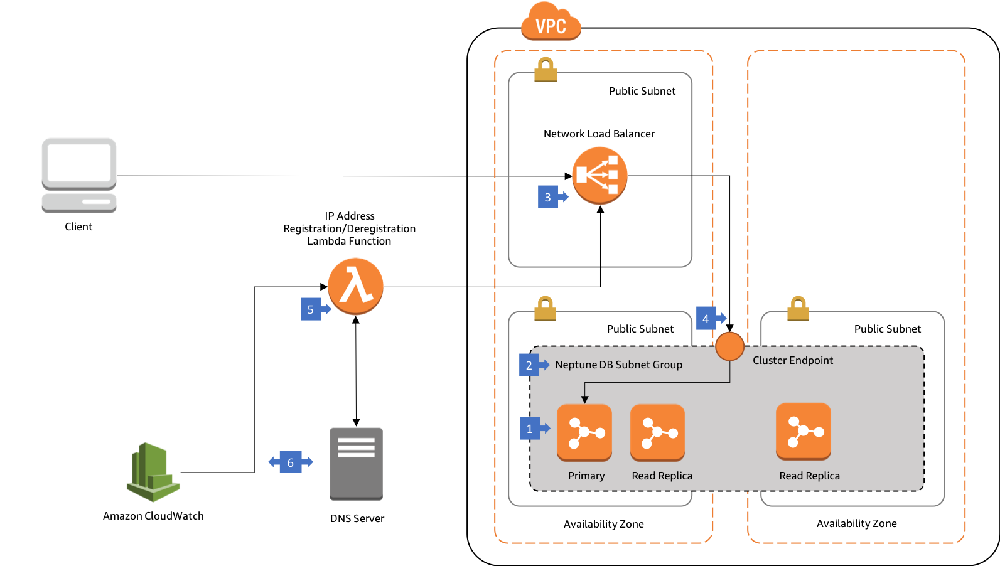
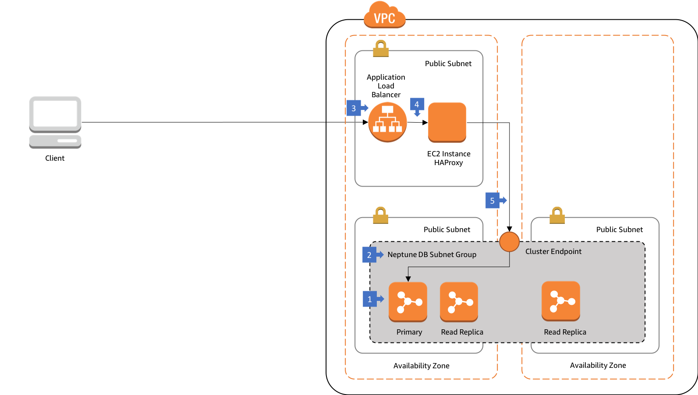

# Connecting to Amazon Neptune from Clients Outside the Neptune VPC

Amazon Neptune only allows connections from clients located in the same VPC as the Neptune cluster. If you want to connect from outside the Neptune VPC, you can use a load balancer. This architecture shows how you can use either a Network Load Balancer or an Application Load Balancer to connect to Neptune.

  * [Connecting to Amazon Neptune from clients outside the Neptune VPC using AWS Network Load Balancer](#connecting-to-amazon-neptune-from-clients-outside-the-neptune-vpc-using-aws-network-load-balancer)
  * [Connecting to Amazon Neptune from clients outside the Neptune VPC using AWS Application Load Balancer](#connecting-to-amazon-neptune-from-clients-outside-the-neptune-vpc-using-aws-application-load-balancer)
  
## Connecting to Amazon Neptune from clients outside the Neptune VPC using AWS Network Load Balancer

You want to connect to your Neptune cluster from clients located outside the VPC in which you launched your Neptune cluster.

Amazon Neptune only allows connections from clients located in the same VPC as the Neptune cluster. In this architecture, clients located outside the VPC connect to Neptune via a Network Load Balancer.

### Walkthrough of the Architecture

  1. In this architecture your Neptune cluster is run in at least two subnets in two Availability Zones, with each subnet in a different Availability Zone.
  2. The Neptune DB subnet group spans at least two subnets in two Availability Zones.
  3. Web connections from external clients terminate on a Network Load Balancer in a public subnet.
  4. The load balancer forwards requests to the Neptune cluster endpoint (which then routes to the primary instance in the database cluster).
  5. The target IP addresses of the cluster endpoint are refreshed on a periodic basis by a Lambda function.
  6. This Lambda function is triggered by a CloudWatch event. When it fires, the function queries a DNS server for the IP addresses of the Neptune cluster endpoint. It registers new IP addresses with the load balancer’s target group, and deregisters any stale IP addresses.
  
### Best Practices

  * Restrict access to your cluster to a range of IP addresses using the security groups attached to the Neptune instances.
  * We recommend further restricting access by enabling [IAM database authentication](https://docs.aws.amazon.com/neptune/latest/userguide/iam-auth.html). IAM database authentication requires all HTTP requests be signed using AWS Signature Version 4, which requires changes to the client. See the Neptune documentation for more details. For IAM auth enabled databases, the client must sign the request using Neptune's DNS and include an HTTP Host header whose value is `<neptune-cluster-dns:port>`. Therefore, the client must know the Neptune cluster's DNS and port in addition to the load balancer's DNS and port. The Host header must reach the Neptune cluster intact. Because it is a Layer 4 load balancer, the Network Load Balancer won't change the HTTP headers: you won't need to configure anything to ensure the Host header arrives intact at the Neptune endpoint.
  * You can [connect to Neptune using SSL](https://docs.aws.amazon.com/neptune/latest/userguide/security-ssl.html) with this architecture. If you are using a load balancer you must use SSL termination and have your own SSL certificate on the proxy server. The Network Load Balancer, although a Layer 4 load balancer, now supports [TLS termination](https://aws.amazon.com/blogs/aws/new-tls-termination-for-network-load-balancers/).
  * We recommend that new cluster IPs are registered with the NLB as soon as they are identified. IPs that appear no longer to be associated with the Neptune cluster should be cautiously deregistered from the NLB – for example, only after three consecutive DNS checks indicate they are no longer associated with the cluster. You can maintain a candidate list of IP addresses to be deregistered using a file stored in an S3 bucket. See [this blog post](https://aws.amazon.com/blogs/networking-and-content-delivery/using-static-ip-addresses-for-application-load-balancers/) for details on implementing a stateful deregistration process.
  * You can increase the availability of the load balancer endpoint by enabling multiple Availability Zones for the load balancer.
  * This architecture enables external clients to access the Neptune cluster endpoint, which always points to the primary instance in the cluster. To enable access to the reader endpoint, which load balances connections across all the read replicas in the cluster, you will need to either create a second target group and a listener configured with a different port, or create a second load balancer with a different DNS name. In either case, you will need to maintain the load balancer’s target IP addresses for the reader endpoint using the Lambda mechanism described above.
  
## Connecting to Amazon Neptune from clients outside the Neptune VPC using AWS Application Load Balancer

You want to connect to your Neptune cluster from clients located outside the VPC in which you launched your Neptune cluster.

Amazon Neptune only allows connections from clients located in the same VPC as the Neptune cluster. In this architecture, clients located outside the VPC connect to Neptune via an Application Load Balancer.

### Walkthrough of the Architecture

  1. In this architecture your Neptune cluster is run in at least two subnets in two Availability Zones, with each subnet in a different Availability Zone.
  2. The Neptune DB subnet group spans at least two subnets in two Availability Zones.
  3. Web connections from external clients terminate on an Application Load Balancer in a public subnet.
  4. The load balancer forwards requests to HAProxy running on an EC2 instance. This EC2 instance is registered in a target group belonging to the ALB.
  5. HAProxy is configured with the Neptune cluster endpoint DNS and port. Requests from the ALB are forwarded to the primary instance in the database cluster.

This architecture differs from the previous architecture in that it introduces two hops between the client and the Neptune instance, whereas the previous architecture introduced only one hop. The previous architecture used all AWS managed services; this architecture introduces a piece of third-party open source software (HAProxy).

### Best Practices

  * Restrict access to your cluster to a range of IP addresses using the security groups attached to the Application Load Balancer.
  * We recommend further restricting access by enabling [IAM database authentication](https://docs.aws.amazon.com/neptune/latest/userguide/iam-auth.html). IAM database authentication requires all HTTP requests be signed using AWS Signature Version 4, which requires changes to the client. See the Neptune documentation for more details. For IAM auth enabled databases, the client must sign the request using Neptune's DNS and include an HTTP Host header whose value is `<neptune-cluster-dns:port>`. Therefore, the client must know the Neptune cluster's DNS and port in addition to the load balancer's DNS and port. The Host header must reach the Neptune cluster intact. In this architecture, the ALB will convert the DNS name in the Host header to an IP address. Therefore, you must configure HAProxy to replace the original Host header with one containing the Neptune cluster DNS and port.
  * You can [connect to Neptune via SSL](https://docs.aws.amazon.com/neptune/latest/userguide/security-ssl.html) with this architecture. Use SSL termination and have your own SSL certificate on the proxy server.
  * You can increase the availability of the publicly available endpoint by enabling multiple Availability Zones for the ALB, adding multiple HAProxy instances in each AZ, and load balancing across the HAProxy instances by including all instances in each ALB’s target group.
  * This architecture enables external clients to access the Neptune cluster endpoint, which always points to the primary instance in the cluster. To enable access to the reader endpoint, which load balances connections across all the read replicas in the cluster, you can configure path-based routing either in the ALB, which will allow you to route to different HAProxy instances, or in HAProxy itself. With path-based routing, the client would add a path suffix – such as `/reader` or `/writer` – to the request URI. For example, to summit a Gremlin query to the Neptune read replicas, the client would use `http://<alb-dns>:80/gremlin/reader`. You will need to rewrite the path to remove this suffix in the ALB or HAProxy before passing the request to the appropriate Neptune endpoint.
