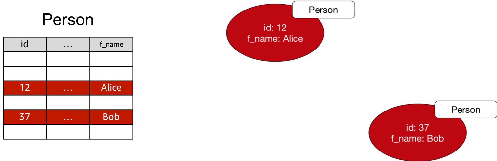
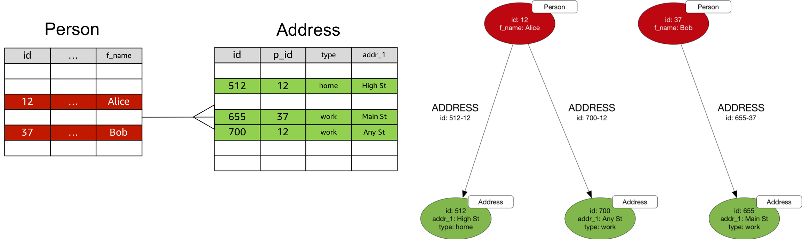
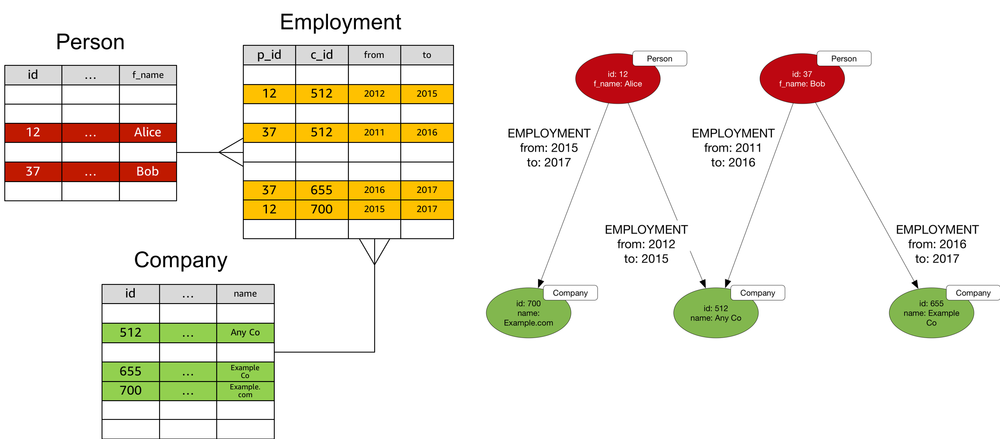
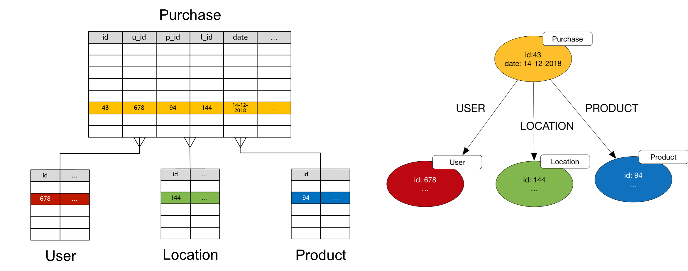
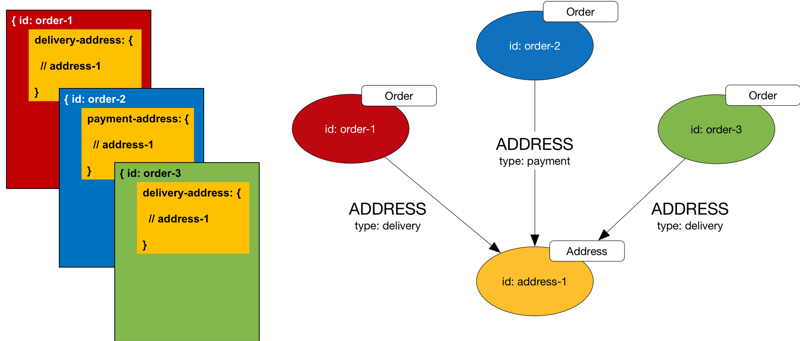
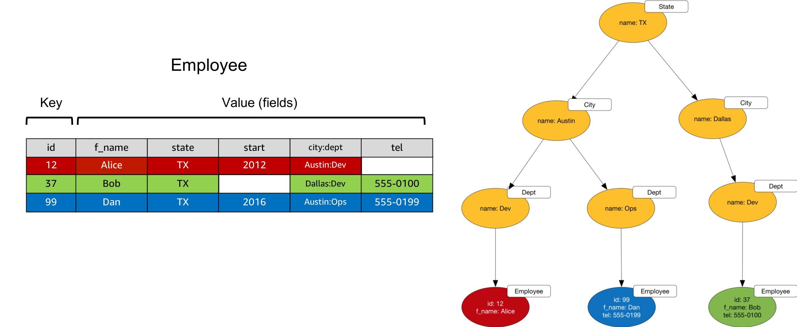

# Converting Other Data Models to a Graph Model

As described in [Overview of the Design Process](../graph-data-modelling#overview-of-the-design-process), when building a graph database application it is best to design an application graph data model and graph queries by working backwards from a set of application use cases, and using the model as a target for any subsequent data ingest from other systems.

However, you may sometimes need to take data from another data technology and ingest it into a graph database prior to undertaking any explicit application-specific graph data modelling. In these circumstances you can apply a number of 'mechanical' transformations that yield a naive graph model. This model will not necessarily be optimised for specific use cases and queries, but it can provide the basis for exploration and the iterative development of an application graph data model.

  * [Converting a Relational Data Model to a Graph Model](#converting-a-relational-data-model-to-a-graph-model)
  * [Converting a Document-Oriented Data Model to a Graph Model](#converting-a-document-oriented-data-model-to-a-graph-model)
  * [Converting a Key-Value Data Model to a Graph Model](#converting-a-key-value-data-model-to-a-graph-model)

## Converting a Relational Data Model to a Graph Model

### Tables

As a rule of thumb, each row in a table can be converted to a vertex in a property graph, or a set of statements with a common subject in an RDF graph. 



When converting to a property graph:

  * Convert the column names to property keys.
  * Use the table name as the label for each vertex. 
  * Concatenate primary key values to generate each vertex ID.

```
g.addV('Person').property(id, '12').property('f_name', 'Alice')
```

When converting to an RDF graph:

  * Column names and values become predicates and object literals.
  * The table name becomes an object literal value of an rdf:type predicate. 
  * Concatenate primary key values to generate each resource ID.

```
PREFIX s: <http://www.example.com/social#>
PREFIX rdf: <http://www.w3.org/1999/02/22-rdf-syntax-ns#>

INSERT
{
    s:12 rdf:type s:Person ;
     s:firstName "Alice" .
}
WHERE {}
```

### Foreign Keys

Foreign key relations can be modelled as edges. 



When converting to a property graph:

  * Choose an edge direction and label that best express the domain semantics of the relationship.
  * Concatenate primary and foreign key values to generate the edge ID.

In Gremlin, assuming the Person and Address vertices already exist:

```
g.V('12').addE('ADDRESS').to(V('512')).property(id, '512-12')
```

When converting to an RDF Graph:

  * Represent the relationship using a triple whose subject and object are URIs identifying the resources to be connected.
  * Choose a direction and predicate value that best express the domain semantics of the relationship.

```
PREFIX s: <http://www.example.com/social#>
PREFIX rdf: <http://www.w3.org/1999/02/22-rdf-syntax-ns#>

INSERT
{
    s:12 s:address s:512 .
}
WHERE {}
```

### Join Tables With Two Foreign Keys

Each row in a join table with two foreign keys can be converted to an edge with edge properties.



When converting to a property graph:

  * Use the join table name for the edge label.
  * Concatenate foreign keys to create the edge ID.
  * Convert the remaining columns to edge properties.

In Gremlin, assuming the Person and Company vertices already exist:

```
g.V('12').addE('EMPLOYMENT').to(V('512')).
  property(id, '12-512').
  property('from', 2012).
  property('to', 2015)
```

When converting to an RDF graph you will have to introduce an intermediate node:

  * Use the join table name to type the node.
  * Concatenate foreign keys to create the subject URI.

```
PREFIX j: <http://www.example.com/jobs#>
PREFIX rdf: <http://www.w3.org/1999/02/22-rdf-syntax-ns#>

INSERT
{
    j:512-12 rdf:type j:Employment ;
      j:from 2012 ;
      j:to 2015 ;
      j:company j:512 ;
      j:person j:12 .
}
WHERE {}
```

### Tables With More Than Two Foreign Keys

If a table contains more than two foreign keys, convert each row to an intermediate node, and convert the foreign keys into edges connecting the intermediate node to other nodes. 



In Gremlin, assuming the User, Location and Product vertices already exist:

```
g.addV('Purchase').property(id, '43').property('date', '14-12-2018').
  V('43').addE('USER').to(V('678')).property(id, '43-678').
  V('43').addE('LOCATION').to(V('144')).property(id, '43-144').
  V('43').addE('PRODUCT').to(V('94')).property(id, '43-94')
```

In SPARQL:

```
PREFIX o: <http://www.example.com/orders#>
PREFIX rdf: <http://www.w3.org/1999/02/22-rdf-syntax-ns#>

INSERT
{
    o:43 rdf:type o:Purchase ;
      o:date "14-12-2018" ;
      o:user c:678 ;
      o:location c:144 ;
      o:product c:94 .
}
WHERE {}
```

## Converting a Document-Oriented Data Model to a Graph Model

Document-oriented databases store semi- or variably-structured documents, usually encoded as JSON or XML. 

Nested Structures

Documents often comprise a nested structure containing all the information necessary to satisfy a business operation. Such self-contained islands of information are sometimes called [aggregates](https://martinfowler.com/bliki/DDD_Aggregate.html). An order document, for example, may contain multiple line items together with the billing and delivery addresses necessary to satisfy payment and fulfilment processes. 

Document-oriented data models favour redundancy over explicit joins. Continuing the order example, if a customer places several orders, each order document will contain its own billing and delivery addresses so that it can be processed as a single unit without having to execute joins in the application layer.

To convert a nested structure to a graph model, extract the nested items and create a node for each unique nested item (thereby removing any data redundancy). Create a node for each parent document and connect this node to the node representing the nested item. Derive an edge label (and, if necessary a qualifying property) from the property key used to identify the nested item in the parent document. 



In Gremlin, create the Orders and Address like this:

```
g.V().addV('Order').property(id, 'order-1').
  addV('Order').property(id, 'order-2').
  addV('Order').property(id, 'order-3').
  addV('Address').property(id, 'address-1').
  V('order-1').addE('ADDRESS').to(V('address-1')).
    property(id, 'order-1-address-1').property('type', 'delivery').
  V('order-2').addE('ADDRESS').to(V('address-1')).
    property(id, 'order-2-address-1').property('type', 'payment').
  V('order-3').addE('ADDRESS').to(V('address-1')).
    property(id, 'order-3-address-1').property('type', 'delivery')
```

In SPARQL we use intermediate nodes to hold the address type property:

```
PREFIX o: <http://www.example.com/orders#>
PREFIX rdf: <http://www.w3.org/1999/02/22-rdf-syntax-ns#>

INSERT
{
    o:order-1 rdf:type o:Order .
    o:order-2 rdf:type o:Order .
    o:order-3 rdf:type o:Order .
    o:address-1 rdf:type o:Address .
    o:order-1-address-1 o:type "delivery" ;
      o:order o:order-1 ;
      o:address o:address-1 .
    o:order-2-address-1 o:type "payment" ;
      o:order o:order-2 ;
      o:address o:address-1 .
    o:order-3-address-1 o:type "delivery" .
      o:order o:order-3 ;
      o:address o:address-1 .
}
WHERE {}
```

### Document Joins

Some document-oriented application models join documents across collections by including the IDs of external documents in a field in the document to which they are to be joined. Treat these scenarios as you would foreign keys in a relational schema.

## Converting a Key-Value Data Model to a Graph Model

A key-value database allows you to model and store data as records comprising key-value pairs. The key can be a simple literal, or, in some cases, a composite of several attributes. A record's value comprises one or more fields. Key-value stores are schemaless, meaning that no two records need share the exact same set of fields.

Much like document-oriented databases, key-value workloads are typically aggregate-oriented:

  * Each record contains all the information necessary to satisfy a business operation, without the application having to join the data in one record to the data in another record. 
  * Applications retrieve discrete records or collections of records using their keys or predicates applied to their keys. Some key-value databases use indexes to facilitate applying predicates and filters at query time to the fields inside each record's value.
  
### Implicit Structure
  
Whilst ostensibly confirming to a very simple data model, many key-value datasets contain implicit structure and connectedness:

  * Both keys and values can be overloaded with structure: a key may comprise a hierarchical prefix, a value a delimited set of tags, for example. Applications that understand a dataset's record semantics can parse keys and values to infer additional structural information.
  * Redundancy across records is common. Field values or families of field values that reoccur in multiple records may refer to a single instance of an entity in the application domain.
  * Individual field values may comprise nested structures – JSON documents, for example.
  * Some field values may act as foreign keys that refer to the IDs of other records, or even other data sources.

Given these features of key-value data models, there's often a lot of graph-like structure that can be teased out of a key-value dataset. You'll need to review the fields and field datatypes for the records in your dataset, and the application semantics applied to keys and values, in order to determine what kind of connected structure is implicit in the dataset.

### Steps to Convert Records to Vertices and Edges in a Graph

  1. Convert each record to a vertex in the graph model. Use the collection or table name in the key-value store to type or label the vertex in the graph.
  2. Parse out any application structure present in the key, and create additional vertices and edges to represent this structure. Use any remaining key data to generate the vertex ID.
  3. Parse out any application structure present in individual fields, and create additional vertices and edges to represent this structure.
  4. Identify nested field values and treat them as documents, applying the same modelling techniques you use to [convert a document-oriented data model to a graph model](#converting-a-document-oriented-data-model-to-a-graph-model).
  5. Identify fields that act as foreign keys, and add edges to join the vertices at either end of the relation. Use the field name to label the edge.
  6. Identify frequently reoccurring fields, families of fields, and field values across records, and consider creating new vertices to represent the entities implied by these fields.
  7. Map remaining record fields to vertex properties.

### Example 

In the following example the `city:dept` field is overloaded with hierarchical information representing geographic and organizational structure. When converting to a graph model, we create additional vertices to represent states, cities and departments, and connect these vertices with edges in line with the connectedness implicit in the `city:dept` familiy of values.




