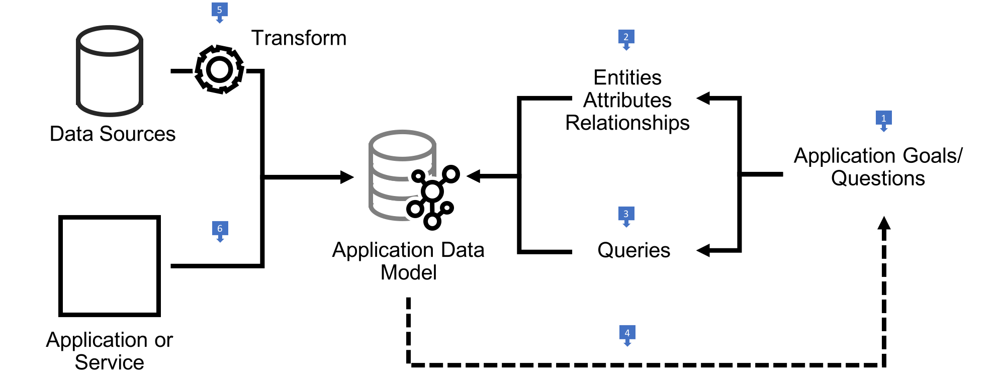

# Graph Data Modelling

When you build a graph database application you will have to design and implement an application graph data model, together with graph queries that address that model. The application graph data model should express the application domain; the queries should answer the questions you would have to pose to that domain in order to satisfy your application use cases.

You build the application graph data model from graph primitives – vertices, edges, labels and properties in the case of a property graph, subject-predicate-object triples for RDF. You name these primitives to express the semantics of the application domain. You structure them to facilitate the path traversals or graph patterns contained in your queries.

Think of your application graph model and your queries as being two sides of the same coin. The graph is the superset of paths or graph patterns expressed in your queries. In order to achieve this degree of alignment between model and queries, employ a 'design for queryability' approach, whereby you drive out the model and the queries on a use-case-by-use-case basis.

## Overview of the Design Process

  1. Work backwards from your application or end-user goals. These goals are typically expressed as a backlog of feature requests, use cases or agile user stories. For each use case write down the questions you would have to put to the domain in order to facilitate the outcomes that motivate the use case. What would you need to know, find, or compute?
  2. Review these questions and identify candidate entities, attributes and relationships. These become the basis of your graph model, implemented using the primitives particular to either the property graph or RDF.
  3. Review these questions and your prototype application graph model to determine how you would answer each question by traversing paths through the graph or matching structural patterns in the graph. Adjust the model until you are satisfied it faciliatates querying in an efficient and expressive manner.
  4. Continue to iterate over your use cases, refining your candidate model and queries as you introduce new features.
  5. Once you have a candidate application graph data model you can treat this as a target for any necessary data migration and integration scenarios. Identify existing sources of data and implement extract, transform and load (ETL) processes that ingest data into the target model.
  6. If you are building an application or service on top of a graph database, design and implement write operations that  insert, modify and if necessary delete data in the target application graph model.
  
### Best Practices

  * Develop your model and queries in a test-driven fashion. Create test fixtures that install a sample dataset in a known state, and write unit tests for your queries (or the parts of your application that encapsulate queries) that assert query results based on a fixed set of inputs.
  * As you evolve your model and add new queries, rerun your tests to identify broken queries that need revising in line with the updated model.

### Learn More

  * For guidance on creating a property graph data model, see [Property Graph Data Modelling](/property-graph-data-modelling)
  * For a worked example of deriving a property graph model from a set of use cases, see the [Property Graph Data Modelling](https://github.com/aws-samples/amazon-neptune-samples/tree/master/gremlin/property-graph-data-modelling) sample
  * For guidance on converting a relational, key-value or document data model to a propery graph model, see [Converting Other Data Models to a Graph Model](./../converting-to-graph)