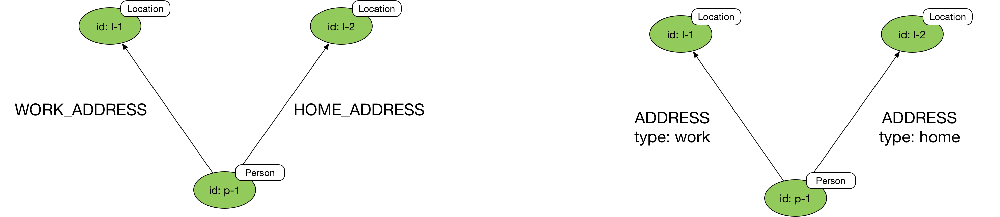
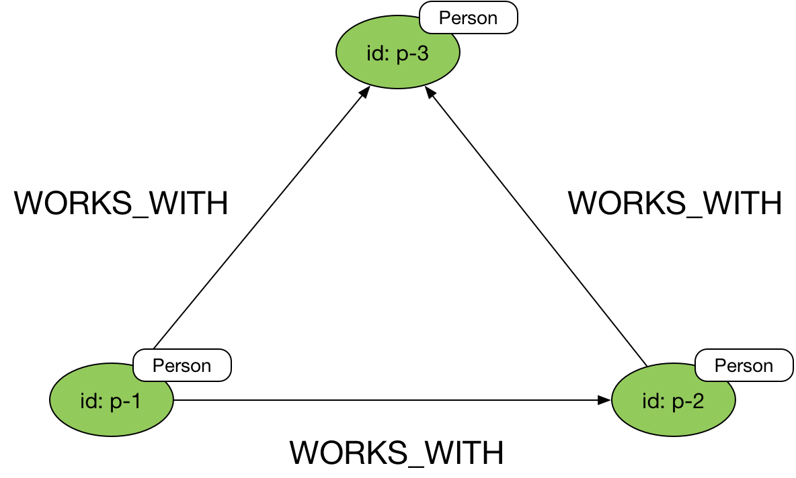
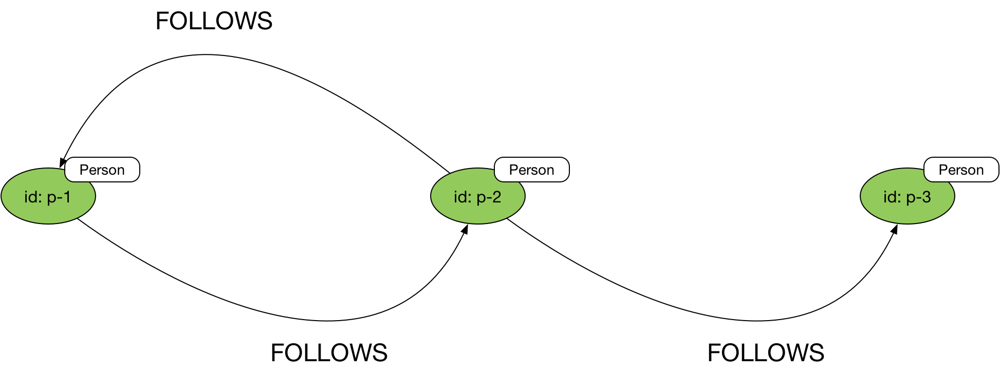
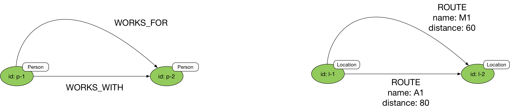
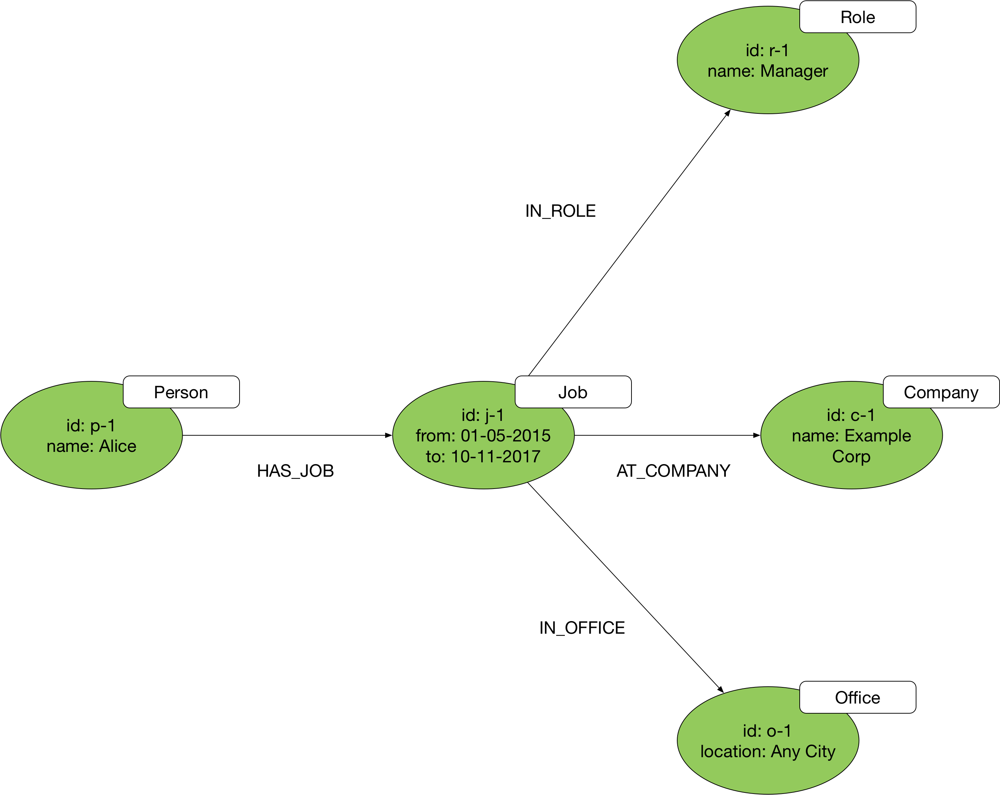
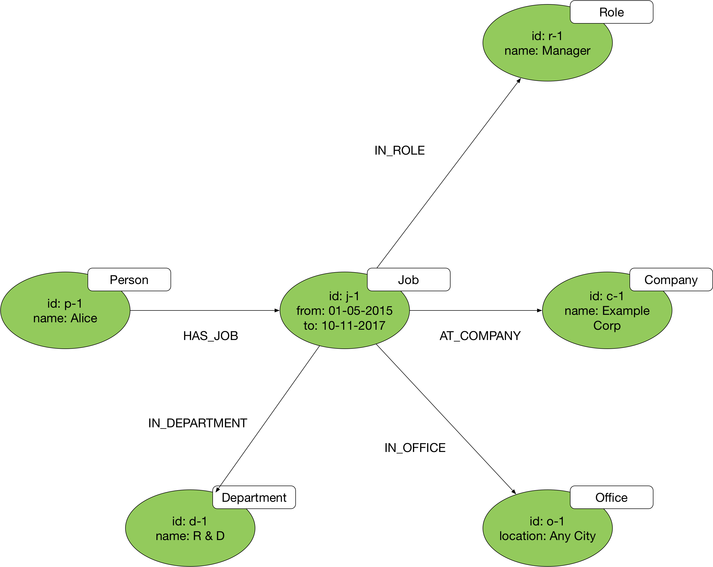

# Property Graph Data Modelling

  - [Building an Application Graph Data Model](#building-an-application-graph-data-model)
  - [Vertices](#vertices)
    - [Vertex IDs](#vertex-ids)
    - [Vertex labels](#vertex-labels)
    - [Vertex properties](#vertex-properties)
    - [When should I model an attribute as a property versus a label?](#when-should-i-model-an-attribute-as-a-property-versus-a-label)
    - [When should I model an attribute as a property and when should I pull it out into its own vertex?](#when-should-i-model-an-attribute-as-a-property-and-when-should-i-pull-it-out-into-its-own-vertex)
      - [Complex value types](#complex-value-types)
      - [Value structures](#value-structures)
      - [Relating entities through their attributes at query time](#relating-entities-through-their-attributes-at-query-time)
  - [Edges](#edges)
    - [Edge IDs](#edge-ids)
    - [Edge labels](#edge-labels)
      - [Bi-directional relationships](#bi-directional-relationships)
      - [Uni-directional relationships](#uni-directional-relationships)
      - [Multiple relationships between vertices](#multiple-relationships-between-vertices)
    - [Edge properties](#edge-properties)
  - [The Hub-and-Spoke Pattern](#the-hub-and-spoke-pattern)
    - [Hub-and-spoke example](#hub-and-spoke-example)
    - [When to use hub-and-spoke](#when-to-use-hub-and-spoke)
    
    
### Learn More

  * For a worked example of deriving a property graph model from a set of use cases, see the [Property Graph Data Modelling](https://github.com/aws-samples/amazon-neptune-samples/tree/master/gremlin/property-graph-data-modelling) sample
  * For guidance on converting a relational, key-value or document data model to a property graph model, see [Converting Other Data Models to a Graph Model](./../../converting-to-graph)


## Building an Application Graph Data Model

An application-specific property graph data model describes how your graph data is structured to express your domain and make it easy and efficient to query for your most important use cases: 

  - What types of vertices do you have in your graph, as represented by vertex labels? 
  - What properties are attached to each type of vertex? 
  - How are different vertices connected? 
  - What edge labels do you use to represent different types of edges? 
  - What properties are attached to these edges? 

By answering these questions you describe an application property graph data model that is specialized for your specific application or set of uses cases.

In the relational world we'd express an application-specific relational model using schema and constraints. In the property graph world, however, there are very few commonly-adopted formal constructs for doing the same. Some graph databases advertise themselves as being schema-free, others allow for optional schema or constraints to be layered on top of the data, while a few require an upfront schema to be defined using a product-specific schema language.

>  Neptune is a schema-free graph database. No two vertices, even those with the same labels, need share the exact same set of properties. No two values of a particular property need use the same datatype. No two pairs of vertices need be connected in the exact same way. 
> The only constraints that Neptune asserts are:
>  - Every edge must have a start vertex and an end vertex. These can be the same vertex: that is, Neptune allows self edges.
>  - All vertex IDs must be unique, and all edge IDs must be unique. However, Neptune does allow a vertex and an edge to have the same ID.

You can use traditional data and application modelling techniques, including entity relationship diagrams (ERD) and the Unified Modelling Language (UML) to model your graph, but many graph application designs begin by illustrating a small, representative example of the graph, with specific vertices, labels, properties and edges showing how instances of things in the application domain are attributed and connected to one another. These _specifications by example_ can then be easily turned into representative datasets against which you can develop and test your queries. 

## Vertices

Use vertices to represent instances of a thing (an entity, concept, event, etc). You can think of a vertex as being roughly equivalent to a row in a relational table.

### Vertex IDs

Some graph databases automatically assign IDs to vertices when they are created, others allow you to supply your own. If the database allows it, consider supplying your own IDs when creating vertices. These could be a stable domain attribute that uniquely identifies an entity – an employee number, for example, or a product SKU – or an ID derived from an original source for the data, such as a primary key in a relational table.

> Neptune allows you to supply your own IDs when you create a vertex. If you don't supply an ID, Neptune will create a string-based UUID for you.

### Vertex labels

Use a vertex label to indicate the entity type or the role that the vertex plays in your dataset. _People, users, customers, products, jobs, policies_: in the singular, _person, user, customer, product, job_ and _policy_ – all good candidate vertex labels.

Try to limit each vertex to having just one label. Entities can sometimes play multiple roles in your dataset: if that's the case, it's fine to attach multiple labels to a vertex. But avoid using labels as flags or enumerated tags that group entities of a particular type. Better to use a property to perform this partitioning. For example, if you wanted to version vertices in your graph, it would be best to do this by attaching a `version` property containing a numeric property value to each vertex, rather than labelling each vertex `v1`, `v2`, `v3`, etc.

### Vertex properties

Use vertex properties to represent the attributes of an entity: _first name, last name, invoice number, height, width, colour, ISBN, price_, etc. One of the modelling benefits of the property graph is that it allows you to 'chunk up' entity attributes into a discrete, easily understood record-like structure: that is, to represent a 'thing' as a labelled vertex with multiple properties.

As well as using vertex properties to model entity attributes, you can also use them to store vertex metadata such as a version number, last updated timestamp, or access control list.

> Gremlin supports single, set and list cardinality for vertex properties. Neptune, however, supports only single and set cardinality, not list, with set cardinality the default. Set cardinality allows you to model multi-value vertex properties containing unique values: an `emailAddress` property, for example, could contain a set such as `[john.smith@example.com,j.smith@example.org,johnsmith@example.net]`.
> 
> If you need to model a list with Neptune – either to maintain list order or to store duplicate values – you have a couple of choices:
>  - If there's no requirement to filter the list's contents at query time, you can store the list as a delimited string representation. To modify the contents of the list, you'll need to implement some logic in your application to retrieve the current representation of the list, parse it into a list type to which you can apply any necessary modifications, and then update the property with a string representation of the new list value.
>  - If you need to filter on the list's contents during a traversal, you'll have to pull the list values out as properties on separate vertices. You can connect these list value vertices either directly to the 'parent' vertex, or to a 'list' vertex that is attached to the parent. You can then use additional properties, either on the edges or on the value vertices themselves, to store metadata, such as item order. While this solution allows for filters or predicates to be applied to list values during a traversal, it introduces more complexity into both the data model and the queries that apply these filters. It may also increase both query latencies and storage costs (every value has the storage overhead of its being a vertex).

### When should I model an attribute as a property versus a label?

Use a label to type a vertex or to describe the role a vertex plays in your dataset. Use properties to capture the instance-based attributes of a thing in your domain. Labels help answer the question: What does this vertex represent? Properties help answer the question: What are the attributes of this particular thing?

### When should I model an attribute as a property and when should I pull it out into its own vertex?

Model an attribute as its own vertex when:

 - the attribute value is a complex value type _and/or_
 - the attribute value is part of a value structure, such as a hierarchy _and/or_
 - the attribute value will be used to relate entities at query time.

#### Complex value types

Complex value types – attribute values that contain more than one field – are best represented as their own vertices. _Address_ is a good example: model address as a separate vertex with `line1`, `line2`, `city`, and `zipcode` properties.

With some applications, you may want to attach metadata such as a timestamp or access control list to a specific attribute (rather than the vertex representing the entity to which the attribute belongs). If your graph database and its data model and query language support [metaproperties](https://kelvinlawrence.net/book/Gremlin-Graph-Guide.html#metaprop) then you can take advantage of these features to implement your use case. 

> Neptune doesn't support metaproperties. To attach attribute-specific metadata, you will have to model the attribute as its own vertex, and add additional properties to this vertex (and/or to the edge connecting this attribute vertex to the entity with which it is associated) to represent your metadata.

#### Value structures

Some value types are part of a set that has its own internal structure. As an example, take the classification hierarchy in an online product catalogue. _Treasure Island_ might be classified as both 'Classic Children's Literature' and as 'Action and Adventure', both of which are subcategories of 'Fiction' in the 'Books' part of the catalogue. Such hierarchical or multi-hierarchical structures are best represented using the subgraph structures enabled by pulling each classification value out into its own vertex.
  
#### Relating entities through their attributes at query time

If an attribute value will be used to create paths through the network that relate entities at query time, consider pulling it out into its own vertex. 

_Social security number_ is a good example. Normally, we'd model social security number by attaching a `socialSecurityNumber` property to a `User` vertex. But in a fraud detection graph, where individuals in a fraud ring share bits of identity information, things are more complicated. Here we might have a connected data query of the form: 

_Given individual X, can we find other people in the graph who have opened accounts using the same social security number as person X?_ 

In other words, we have a starting point, person X, but need thereafter to find other people who have something in common with person X based on a specific attribute – the social security number used by person X. 

Note that this connected data query is very different from the kind of query that asks: 

_Find everyone who has used social security number '123-45-6789'._ 

This latter query could be satisfied simply by filtering `User` vertices based on a `socialSecurityNumber` value that is known to us at the time the query is formulated. It's the equivalent of a simple key-value lookup. In the connected data query, in contrast, we don't necessarily know the social security number at query time. What we do know is how to identify person X. Having found person X, the connected data query then needs to find other people who are connected to X by way of some shared attribute – the social security number.

If you are considering modelling an attribute as its own vertex in order to facilitate connected data queries, apply good judgement based on your understanding of the domain. The new vertex should probably represent a significant concept in the domain. In the fraud detection example, bits of identity information are meaningful domain entities that can exist independent of the users with which they are associated. In other domains, the same might not be true of these same attributes.

## Edges

Use edges to represent the relationships between things in your domain. 

The performance of a graph query depends on how much of the graph the query has to 'touch' in order to generate a set of results. The larger the working set, the longer it will take to get from storage and then traverse once it has been cached in main memory.


You can ensure your queries touch the minimum amount of data by naming edges in a way that allows the query engine to follow only those relationships relevant to the query being executed. 


Edges compose and partition the graph. By connecting vertices, they structure the whole, creating a complex composite from what would otherwise be simple islands of data. At the same time they serve to partition the graph, differentiating connections between elements based on name, direction and property values so that queries can identity specific subgraphs within a larger, more variably connected structure. By focussing your queries on certain edge labels and directions, and the paths they form, you allow the query engine to exclude irrelevant parts of the graph from consideration, effectively materializing a particular view of the graph dedicated to addressing a specific query need.

### Edge IDs

Every edge has an ID. Some graph databases automatically assign IDs to edges when they are created, others allow you to supply your own. Because every edge has its own identity, the property graph allows you to create multiple edges with the same labels (and properties) between any given pair of vertices.

> Neptune allows you to supply your own IDs when you create an edge. If you don't supply an ID, Neptune will create a string-based UUID for you.

### Edge labels

Derive your edge labels from your use cases. Doing so helps structure and partition your data so that queries ignore vertices and edges that have no bearing on the working set necessary to satisfy the query.



If your queries need only find relationships with a particular name drawn from a family of names (for example, of all the addresses in the dataset, one query needs only find work addresses, another only home addresses), then consider using fine-grained edge labels or predicates.

If some or all of your queries need to find all relationships belonging to a particular family (for example, all addresses, irrespective of whether they are work or home addresses), use a more general name qualified with an edge property. The tradeoff here is that queries that require only specific relationship types (for example, work addresses) will touch more of the graph and will have to filter based on the edge property, but the design provides for both finding all edges with a particular name, and finding specific types of edges belonging to that family.

#### Bi-directional relationships

If you need to model bi-directional relationships, in which relationship direction is of no consequence to the model, you can use a single, directed relationship, but ignore its direction in your Gremlin queries using the `both()` or `bothE()` steps.



Here's an example query that ignores edge direction:

```
g.V('p-1').both('WORKS_WITH')
```

#### Uni-directional relationships

Edges in a property graph are always directed: ideal for expressing uni-directional relationships.



In Gremlin you then explicitly state the direction you wish to follow in your queries using the `in()`, `out()`, `inE()` and `outE()` steps:

```
g.V('p-1').in('FOLLOWS')
```

or

```
g.V('p-1').out('FOLLOWS')
```

> ### Favour outgoing edges
> Neptune is optimized for traversing outgoing edges. Therefore, if possible, design your model so that your performance-critical queries follow mostly outgoing edges.
>
> If a query has to traverse an incoming edge, always specify the edge label as part of the query, even if there is only one type of edge label that the traversal could possibly follow. For example, for a vertex that has only `CREATED` incoming edges, we would recommend using `in('CREATED')` and `inE('CREATED')` rather than `in()` and `inE()` to traverse those edges.

#### Multiple relationships between vertices

You can connect any pair of vertices with multiple edges. These edges can all have hte same name, or they can have different names. Each edge represents an instance of a connection between the start and end vertices. In many cases, such edges will be attributed with one or more distinguishing properties, such as timestamps. 



### Edge properties

Use edge properties to represent the strength, weight or quality of a relationship. Using edge properties, you can further filter which edges a traversal follows – following only `KNOWS` edges in a social graph whose `strength` property is greater than 5, for example – or compute a cumulative result along a path – calculating the shortest, or cheapest, or quickest route through a logistics network, for example.

You can also use edge properties to store metadata such as a version number, last updated timestamp, or access control list.

> ### A note on predicates
> In RDF terms, both edge labels and edge and vertex property names are considered predicates. Neptune is optimized for datasets containing a relatively small number of unique predicates – in the order of several thousand at most. A dataset containing 100,000 `User` vertices, each with 5 properties, and 1 million `FOLLOWS` edges has 6 unique predicates (5 vertex properties and 1 edge label).
> 
> Keep the number of predicates in your data model relatively small. Databases with many tens of thousands or even millions of unique predicates can experience a drop in performance.

## The Hub-and-Spoke Pattern

One of the most common patterns in property graph data modelling is the hub-and-spoke structure, comprising a central vertex connected to several neighbouring vertices. This central vertex often represents a fact or event, the neighbouring vertices contextual information that helps explain or enrich our understanding of this hub vertex. An example would be a `Purchase` hub vertex, representing a purchasing event, connected to the `User` who made the purchase, the several `Product` items in the user's shopping basket, and the `Shop` where the items were bought.

The hub-and-spoke subgraph structure is similar to the star schema or facts and dimensions model employed in data warehousing. Each hub node represents an instance of a fact or event (or other entity). A hub vertex is connected to one or more spoke or dimension vertices. These dimension vertices in turn are often connected to multiple other fact vertices: a `User` makes many purchases; a `Product` appears in multiple shopping baskets. The subgraph structure may occur thousands or millions of times in a dataset, with the dimension vertices acting as contextual intermediaries through which facts or events can be related.

Sometimes this pattern will emerge as a straightforward representation of your domain. At other times, you may find yourself moving to this pattern to accomodate several different use cases and the queries associated with them, or to provide for the longterm evolvability of your model. Your overall goal is to design an application graph data model that is expressive of your domain, easy to query on behalf of your most important use cases, and easy to evolve as you discover new use cases and introduce new features into your application. If your data model is too simple, it can become difficult to add new use cases and queries. If it is too complex, it can become difficult to maintain, and may impose a performance penalty of some of your more important queries. Aim to be as simple as you can given the needs of your application, and no simpler.

### Hub-and-spoke example

Consider how we might represent a person's employment details in an application graph data model. If all we need to know, given our current and anticipated new use cases, is the company where a person worked, the following will suffice:


We can even add properties to the `WORKED_AT` edge to describe Alice's role, and the period during which she worked for Example Corp (e.g. `from` and `to` properties, with data values):


But if our application use cases require us to ask deeper questions of Alice's employment history – In which office was she located? How did her role relate to other roles in the company? – then we'll need to adopt a more complex model based on the hub-and-spoke pattern:



Here we've taken the action encoded in the `WORKED_AT` edge ('working' or 'worked', a verb) and turned it into a vertex labelled `Job` (a noun) that acts as a hub connected by way of `HAS_JOB` and `AT_COMPANY` edges to the vertices representing Alice and Example Corp. You'll find that most edges can be decomposed in this way into a more complex vertex-and-two-edges structure. The trick is in identifying when this is _necessary_.

The advantage of this model is that it allows for the longterm evolvability of your application. You can always add new types of dimension nodes as you learn more about your domain and introduce new features. If a new use case emerges that requires us to capture details of the department to which Alice belonged (an organisational hierarchy worthy of its own subgraph structure), for example, we can easily add a new `Department` vertex to the model:



### When to use hub-and-spoke

It's tempting to apply this pattern everywhere, transforming every edge in your 'naive' model into a vertex-and-two-edges structure. But if you don't need the richness and flexibility of this subgraph structure, don't use it: you'll end up increasing storage overheads and query latencies (more data to store, fetch and traverse) for no appreciable benefit.

Conversely, you may be struggling with an overly simplistic model derived from your first natural language description of your domain. Problems often present themselves when you find yourself wanting to add an edge to an edge – to annotate one relationship with another. This can sometimes be the result of _verbing_ – the language habit whereby a noun is transformed into a verb. For example, instead of saying X `SENT` an `Email` `TO` Y, we might verb the noun, and say X `EMAILED` Y. If this is the basis of our model, problems emerge when we want to indicate who was CCd on the mail, or describe one email as being a reply to another. By pulling out the domain entity inherent in the verb – `Email` from `EMAILED` – we can introduce a hub node that allows for far more expressive structuring of entities and relationships.

If you're struggling to come up with a graph structure that captures the complex interdependencies between several things in your domain, look for the nouns, and hence the domain concepts, hidden inside of some of the verb phrases you've used to describe the structuring of your domain. 

While some hub vertices lie hidden in verbs, other hub-and-spoke structures can be found in adverbial phrases – those additional parts of a sentence that describe how, when or where an action was performed. Adverbial phrases result in what entity-relational modelling calls _n-ary relationships_; that is, complex, multi-dimensional relationships that bind together several things and concepts. The hub-and-spoke pattern is ideal for these kinds of n-ary relationships. While it may sometimes feel as though you're encumbering your model with another vertex just to accomodate the need for multiple relationships, you can invariably find a good, domain-meaningful term for this hub vertex that helps make the model more expressive. 

